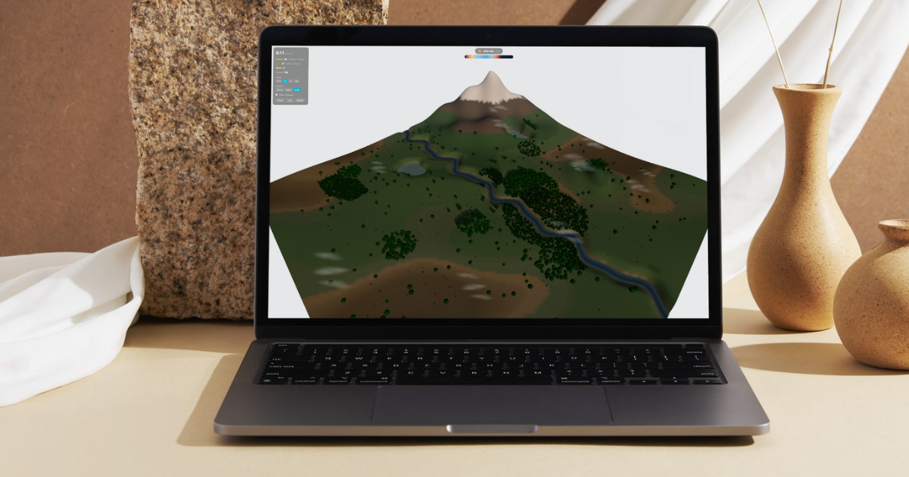
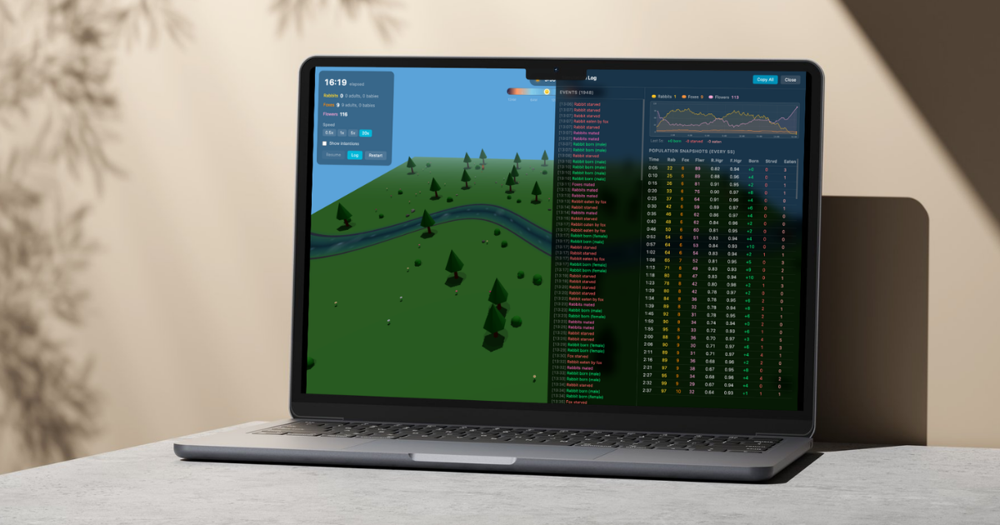
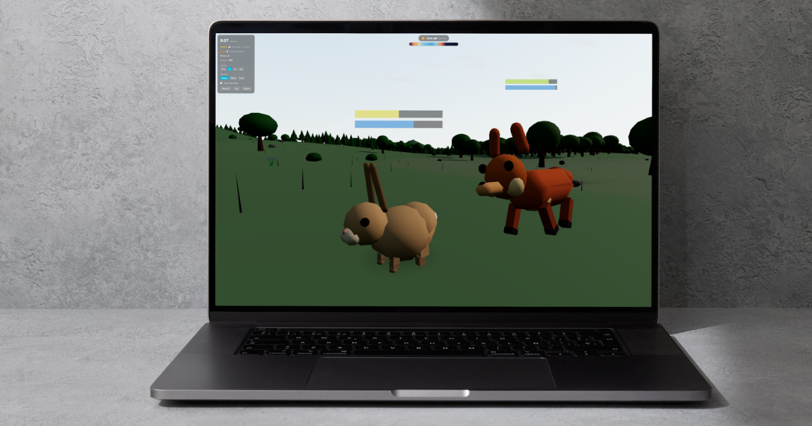

# 🌿 Ecosystem Simulation

> *Where rabbits multiply, foxes hunt, moose wander, and chaos reigns supreme!*

Welcome to the most adorable (and slightly brutal) ecosystem simulation you'll ever witness. Watch as fluffy bunnies hop around, cunning foxes hunt for dinner, and majestic moose... well, they just moose around. It's like The Lion King, but with more React and fewer musical numbers.



## 🎮 What Is This Madness?

This is a **3D ecosystem simulation** built with React Three Fiber where you can:

- 🐰 **Watch rabbits** multiply like... well, rabbits
- 🦊 **Observe foxes** hunt with the cunning of a thousand suns
- 🦌 **Marvel at moose** being majestic (and occasionally hungry)
- 🌸 **Admire flowers** that grow, get eaten, and grow again
- 🌧️ **Experience weather** that changes from sunny to rainy
- 🌙 **Witness day/night cycles** that affect animal behavior
- 📊 **Track populations** with real-time graphs



## ✨ Features That Make This Awesome

### 🎯 Smart Animal Behavior
- **Hunger & Thirst System**: Animals actually need to eat and drink (who knew?)
- **Mating & Reproduction**: Watch populations boom (or bust)
- **Predator-Prey Dynamics**: Foxes hunt rabbits, rabbits flee foxes (classic!)
- **Terrain Awareness**: Animals navigate around trees, rivers, and obstacles
- **Day/Night Vision**: Animals see better during the day (shocking, I know)

### 🌍 Dynamic World
- **Procedural Terrain**: Every simulation is unique
- **Weather System**: Rain affects visibility and behavior
- **Rivers & Ponds**: Animals need water (they're not cacti)
- **Flowers**: Grow, get eaten, regrow (the circle of life!)

### 📈 Analytics & UI
- **Population Graphs**: Watch species rise and fall
- **Real-time Logs**: See what's happening in the ecosystem
- **HUD**: Track time, weather, and population counts
- **Timeline Controls**: Speed up, slow down, or pause the chaos



## 🚀 Getting Started

### Prerequisites
- Node.js (v18 or higher recommended)
- npm or yarn

### Installation

```bash
# Clone the repository
git clone <your-repo-url>
cd ecosystem

# Install dependencies
npm install

# Start the development server
npm run dev
```

Then open your browser to `http://localhost:5173` (or whatever port Vite assigns you).

### Building for Production

```bash
npm run build
npm run preview
```

## 🎛️ Configuration

When you start the simulation, you can configure:

- **Rabbits**: 1-40 (default: 30)
- **Foxes**: 1-14 (default: 8)
- **Moose**: 0-12 (default: 3)
- **Flowers**: 10-120 (default: 65)

*Pro tip: Start with fewer foxes if you want rabbits to survive longer than 5 seconds.*

## 🛠️ Tech Stack

- **React 19** - Because we like the latest and greatest
- **TypeScript** - For type safety (and fewer bugs)
- **React Three Fiber** - 3D graphics made easy
- **Three.js** - The 3D powerhouse
- **Framer Motion** - Smooth animations
- **Tailwind CSS** - Beautiful styling without the pain
- **Vite** - Lightning-fast dev server

## 🎨 Project Structure

```
ecosystem/
├── src/
│   ├── components/
│   │   ├── canvas/      # 3D world components (terrain, trees, etc.)
│   │   ├── entities/    # Animal components (rabbits, foxes, moose)
│   │   └── ui/          # UI components (HUD, graphs, logs)
│   ├── hooks/           # Custom React hooks
│   ├── state/           # State management (context, actions)
│   ├── types/           # TypeScript type definitions
│   └── utils/           # Utility functions
└── public/
    └── images/          # Preview images (you're looking at them!)
```

## 🐾 How It Works

1. **Animals have needs**: Hunger and thirst decrease over time
2. **Behavioral states**: Animals switch between wandering, seeking food/water, fleeing, chasing, eating, drinking, and mating
3. **Steering behaviors**: Animals use steering forces to navigate and avoid obstacles
4. **Terrain collision**: Animals can't walk through trees (physics!)
5. **Population dynamics**: Animals reproduce when conditions are right, die when they're not

## 🎭 Known Behaviors (Features, Not Bugs!)

- Rabbits sometimes jump for joy (or fear)
- Foxes are persistent hunters (they don't give up easily)
- Moose are... moose (they do moose things)
- Animals might get stuck occasionally (they're not perfect, okay?)
- Population explosions are normal (rabbits gonna rabbit)

## 🤝 Contributing

Found a bug? Have an idea? Want to add more animals?

1. Fork the repo
2. Create a feature branch (`git checkout -b feature/amazing-feature`)
3. Commit your changes (`git commit -m 'Add some amazing feature'`)
4. Push to the branch (`git push origin feature/amazing-feature`)
5. Open a Pull Request

*Note: Adding dinosaurs is encouraged but not required.*

## 📝 License

This project is open source and available under the MIT License.

## 🙏 Acknowledgments

- The rabbits, foxes, and moose for their cooperation (they didn't have a choice)
- React Three Fiber community for making 3D React development awesome
- Nature, for being the inspiration (and the template)

## 🎬 Final Thoughts

This simulation is a work in progress. Animals might do weird things, populations might crash unexpectedly, and sometimes everything just works perfectly. It's like real life, but with more code and fewer consequences.

**Enjoy watching your digital ecosystem thrive (or collapse)!** 🌿🐰🦊🦌

---

*Made with ❤️ and a healthy dose of curiosity about how ecosystems work.*
